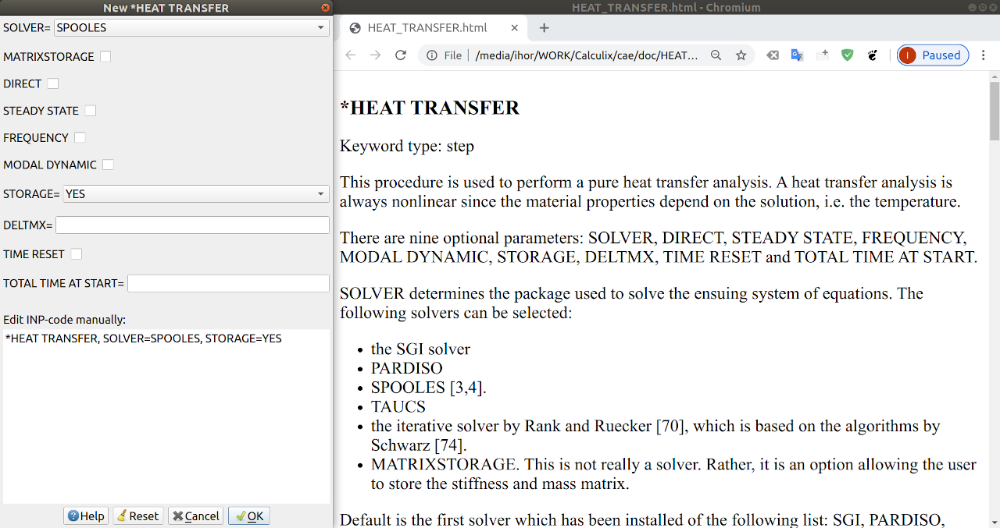
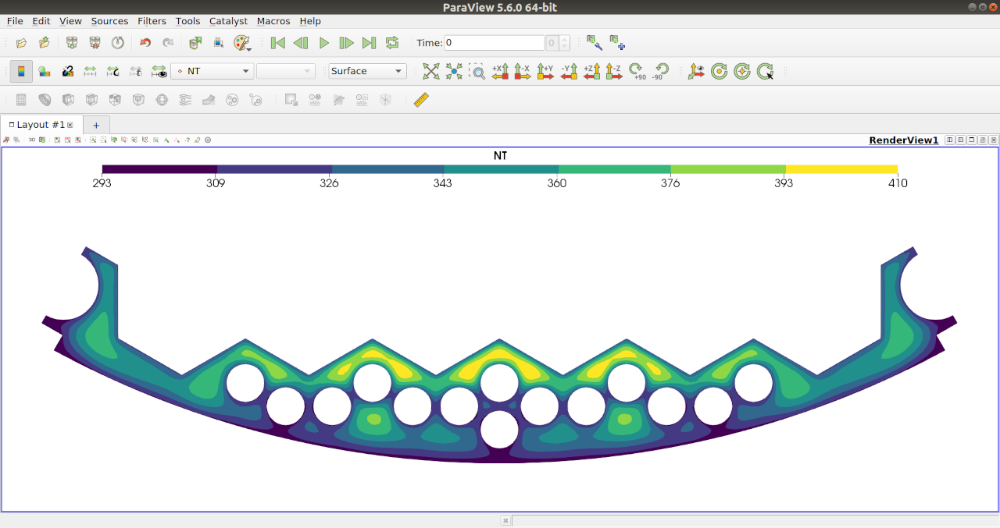

© Ihor Mirzov, August 2019  
Distributed under GNU General Public License v3.0

  

# CalculiX CAE

GUI/pre-processor for [CalculiX CrunchiX](http://dhondt.de/). Very simple, free and open source. Program is based on CalculiX keywords hierarchy. Written in Python3, utilizes PyQt5 and VTK.

It is implied that you have already created geometry and generated mesh in some other software like [Salome-platform](https://www.salome-platform.org/). CacluliX CAE is designed to guide you through the keywords creation sequence and is aimed to help you reach correct input file with no mistakes.

  

# Features

- Calculix keywords hierarchy with all attributes is maintaned in [editable XML file](src/ccx_kom.xml).

- "New keyword" dialog shows apropriate chapter of the official [HTML documentation](doc).

- INP format for all needs: program parses .inp-file and generates model on the fly, so separate format for the model is not needed. Final model is saved also with .inp format ready to be calculated by CalculiX.

- [Solid mesh parser](src/ccx_mesh.py) supports includes in the input file. Tested on the all official CacluliX examples. See [tests.log](tests.log).

- Surfaces and sets of the imported mesh could be highlighted in the [VTK widget](src/ccx_vtk.py).

- Application's global settings are maintained in [editable env-file](src/ccx_settings.env) with Python syntax. Settings are automatically saved during the workflow.

- [Optimal job management](src/ccx_job.py):

    - if you use [subroutines](ccx/ccx_free_form_fortran), CalculiX sources could be automatically recompiled from GUI;
    - run analysis directly from GUI - you'll be notified on job completion;
    - open results in GraphiX or convert to VTU format and open them in [Paraview](https://www.paraview.org).

- Supports UNV mesh import.

- Cute modern design with [nice icons](img).

  

# Screenshots

Main window with imported mesh and highlighted node set after job calculation:

"New keyword" dialog with corresponding chapter from HTML manual:

Main window and "new keyword" dialog in a simple view mode with hidden VTK widget and HTML help:

Calculation result exported to Paraview:

  

# Downloads

Both sources and binaries could be found on [the releases page](https://github.com/imirzov/ccx_cae/releases).

  

# How to use

CacluliX CAE is portable software and doesn't need to be installed. Just extract archive, make binary executable and run it with double click. **To view results in GraphiX and Paraview configure pathes in File->Settings**.

The intended workflow is:
- create geometry and mesh in [Salome-platform](https://www.salome-platform.org/),
- save mesh as UNV or export it to INP with [SalomeToCalculix GUI tool](https://github.com/psicofil/SalomeToCalculix),
- import INP or UNV mesh to CAE and continue creating model,
- if needed, edit Fortran subroutines and rebuild ccx (Job->Rebuild CalculiX),
- submit job from CAE,
- export job result to the Paraview post-processor or view it in GraphiX.

Edit default startup model name in in File->Settings or you can pass it as an argument to open at start:

    in Linux:       ./ccx_cae -inp model.inp
                    ./ccx_cae -inp model.unv
    in Windows:     ccx_cae.exe -inp model.inp
                    ccx_cae.exe -inp model.unv

  

# Your help

Please, you may:

- Simply use this software and ask questions.
- Share your models and screenshots.
- Report problems by [posting issues](https://github.com/imirzov/ccx_cae/issues).
- Do something from the [TODO-list](#TODO).
- Follow discussion in the [Yahoo CalculiX Group](https://groups.yahoo.com/neo/groups/CALCULIX/conversations/topics/15616)

  

# For developers

Suppose you already have [Python 3](https://www.python.org/downloads/). Open terminal in CalculiX CAE directory and install dependancies with command:

    pip3 install -r requirements.txt

Run source code with one of the commands:

    python3 ccx_cae.py
    python3 ccx_cae.py -inp model.inp
    python3 ccx_cae.py -inp model.unv

Use [pyinstaller](https://www.pyinstaller.org/) or [release_binaries.py](release_binaries.py) to create releases:

    pyinstaller ccx_cae.py
    python3 release_binaries.py

CalculiX CAE uses external converters:
- [ccx2paraview](https://github.com/imirzov/ccx2paraview) - CalculiX to Paraview converter (frd to vtk/vtu)
- [unv2ccx](https://github.com/imirzov/unv2ccx) - Salome universal to CalculiX converter (unv to inp)

The source code for the CalculiX solver is taken from the [free_form_fortran project](https://github.com/imirzov/ccx_free_form_fortran). This version has much better code folding and readability.

To compile CalculiX sources from CAE you'll need compilers:

    in Ubuntu:  gcc, gfortran
    in Windows: cygwin

  

# TODO

**Done for the next release**

- Show/Hide HTML help in the keyword edit Dialog.

- Show/Hide VTK mesh visualization widget.

- Keywords hierarchy implemented with XML format. Now it's only 1e-4 seconds faster :) but the source code is much simpler.

- File->Settings user dialog.

- ToolBox panel hides with VTK widget.

- Menu Job.

- Automatically recompile CalculiX sources with updated subroutines.

**Improvements and bugfixes**

- Better ViewSurfaceWithEdges - implement it manually without EdgeVisibilityOn().

- Better surface highlight: remove original face for pure color.

- During keyword's edit parse arguments and pass them to Dialog. Reparse mesh objects after edit. 

**New features**

- treeView: show implementations only.

- Visualize BC's, constraints and loads in VTK.

- Python code (*PYTHON keyword) in INP_code for step repetition and other kind of model generation.

- Import certain keyword with descendants (tree branch) from INP-file.

- Interface for materials import. Enrich Materials library.

- Import mesh from FRD, [VTK](https://lorensen.github.io/VTKExamples/site/Python/IO/ReadLegacyUnstructuredGrid/), [VTU](https://lorensen.github.io/VTKExamples/site/Python/IO/ReadUnstructuredGrid/), [Gmsh](http://gmsh.info/), Abaqus INP and ODB.

- Prool's INP-templates and snippets.

- Include Martin Kraska examples.

- Menu Help:
    - PDF manual / YouTube videos for beginners.
    - VTK Keyboard Shortcuts and Controls.
    - Links to other GitHub projects.
