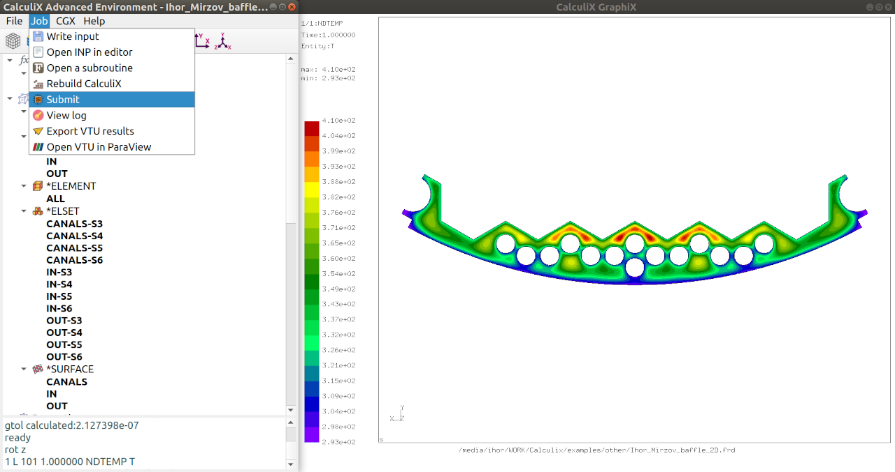

© Ihor Mirzov, May 2020  
Distributed under GNU General Public License v3.0

  

---

[Features](#features) |
[Screenshots](#screenshots) |
[Downloads](#downloads) |
[How to use](#how-to-use) |
[Your help](#your-help) |
[For developers](#for-developers) |
[What's new](#whats-new) |
[TODO](#todo)

---

  

# CalculiX CAE

GUI/pre-processor for [CalculiX CrunchiX](http://dhondt.de/). Very simple, free and open source. Program is based on CalculiX keywords hierarchy. Written in Python3 and utilizes PyQt5.

It is implied that you have already created geometry and generated mesh in some other software like [FreeCAD](https://www.freecadweb.org/) or [Salome-platform](https://www.salome-platform.org/). CacluliX CAE is designed to guide you through the keywords creation sequence and is aimed to help you reach correct input file with no mistakes.

  

# Features

- CalculiX CAE goes with the latest CGX and CCX compiled for Linux and Windows. Windows version of CGX is taken from [CalculiX Launcher v3.4](http://www.calculixforwin.com/) 

- INP format for all needs: program parses .inp-file and generates model on the fly, so separate format for the model is not needed. Final model is saved also with .inp format ready to be calculated with CCX.

- Official [HTML documentation](doc) is natively integrated into the keyword edit dialogs.

- Calculix keywords hierarchy with all attributes is maintaned in [editable XML file](config/kom.xml).

- [Solid mesh parser](src/model/parsers/mesh.py) supports includes in the input file. Tested on the all official CacluliX examples. See [tests.log](src/tests.log).

- Application's global settings could be set up in the File->Settings menu. Settings are maintained in editable env-file with Python syntax. The file is automatically overwritten during the workflow.

- [Optimal job management](src/model/job.py):

    - if you use subroutines, CalculiX sources could be automatically recompiled from GUI;
    - run analysis directly from GUI;
    - open results in GraphiX or convert to VTU format and open them in [Paraview](https://www.paraview.org).

- Supports UNV mesh import.

- Cute modern design with [nice icons](img).

  

# Screenshots

CAE and CGX windows with imported mesh and painted surfaces:

"New keyword" dialog with corresponding chapter from HTML manual:

CAE and CGX windows with calculated model:

Calculation result exported to Paraview:

  

# Downloads

Both sources and binaries could be found on [the releases page](https://github.com/calculix/cae/releases).

  

# How to use

CacluliX CAE is portable software and doesn't need to be installed. Just extract archive, make binary executable and run it with double click. **To view results in Paraview configure path in File->Settings**.

The intended workflow is:

- create geometry and mesh in [Salome-platform](https://www.salome-platform.org/),
- save mesh as UNV or export it to INP with [Salome to CalculiX mesh exporter](https://github.com/psicofil/SalomeToCalculix),
- import INP or UNV mesh into CAE and continue creating model,
- if needed, edit Fortran subroutines and rebuild CCX (Job->Rebuild CalculiX),
- submit job from CAE,
- export job result to the Paraview post-processor or view it in GraphiX.

Edit default startup model name in in File->Settings or you can pass it as an argument to open at start:

    in Linux:       ./cae.sh -inp model.inp
                    ./cae.sh -inp model.unv
    in Windows:     cae.bat -inp model.inp
                    cae.bat -inp model.unv

  

# Your help

Please, you may:

- Simply use this software and ask questions.
- Share your models and screenshots.
- Do something from the [TODO-list](#TODO).
- Report problems by [posting issues](https://github.com/calculix/cae/issues). If any error accured, please, in the settings dialog change the Logging level to 'DEBUG', then repeat actions leading to the error. In such a way you'll obtain much more detailed log - attach it to the problem report.

  

# For developers

Suppose you already have [Python 3](https://www.python.org/downloads/). Open terminal in CalculiX CAE directory and install dependancies with command:

    pip3 install -r requirements.txt

From 'src' directory run source code with one of the commands:

    python3 cae.py
    python3 cae.py -inp model.inp
    python3 cae.py -inp model.unv

Use [make_release.py](make_release.py) to create releases:

    python3 make_release.py

CalculiX CAE uses external converters:

- [ccx2paraview](https://github.com/calculix/ccx2paraview) - CalculiX to Paraview converter (frd to vtk/vtu)
- [unv2ccx](https://github.com/calculix/unv2ccx) - Salome universal to CalculiX converter (unv to inp)

The source code for the CalculiX solver is taken from the [free_form_fortran project](https://github.com/calculix/free_form_fortran) - this version has much better code folding and readability.

In Windows to work with subroutines and to recompile CalculiX sources from CAE you'll need *cygwin*. Install it to 'C:\\cygwin64' with:
- gcc-g++ 7.3.0-3
- gcc-fortran 7.3.0-3
- make 4.2.1-2
- perl 5.26.3-2

**Attention!** In Windows CCX may not work if placed outside 'bin' directory. It needs Cygwin DLLs! So, if you change path to CCX, place there Cygwin DLLs from 'bin' directory.

  

# What's new

+ CalculiX solver v. 2.16.
+ UNV2CCX converter v. 1.1.
+ From now CGX is embed into the distribution!
+ CAE sends commands to CGX to highlight surfaces, node and element sets.
+ All logs are handled in the textEdit (including CGX messages).
+ INP example models are excluded from distribution. See menu Help. Download examples from https://github.com/calculix/examples
+ Mesh object is reparsed after edit in the treeView.
+ Elsets and surfaces could be painted in different colors. See menu Job.

  

# TODO

- During keyword's edit parse arguments and pass them to Dialog.
- Settings Dialog: add buttons to Pathes to open files.

- Python code (*PYTHON keyword) in the INP_code for step repetition and other kind of model generation. Invent some kind of Python API for CAE.

- treeView: import certain keyword with descendants (tree branch) from INP-file.
- treeView: show implementations only.

- Interface for materials import. Enrich Materials library.
- Prool's INP-templates and snippets.

- [meshio converter](https://github.com/nschloe/meshio)
- Import mesh from FRD, [VTK](https://lorensen.github.io/VTKExamples/site/Python/IO/ReadLegacyUnstructuredGrid/), [VTU](https://lorensen.github.io/VTKExamples/site/Python/IO/ReadUnstructuredGrid/), [Gmsh](http://gmsh.info/), Abaqus INP and ODB.

- Forward .fbd/.fbl to CGX.
- [Martin Kraska examples](https://github.com/mkraska/CalculiX-Examples)
- M.Kraska: support the param.py parametrization mechanism.

- Menu Help: PDF manual / YouTube videos for beginners.

- CAE should be independent and be able to be embeded into FreeCAD.

- Change CGX colormaps via Xlib.

- Reparse mesh/model after tree.actionDeleteImplementation.

- Merge tests.py and model.parsers.mesh.py
