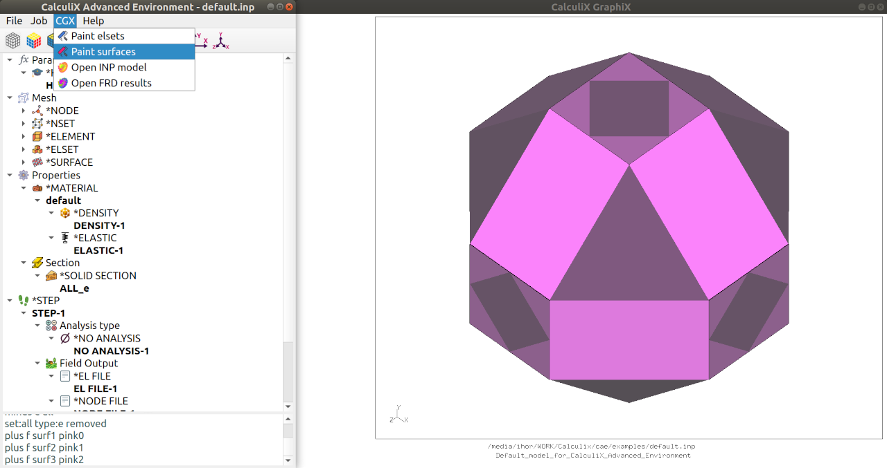

© Ihor Mirzov, June 2020  
Distributed under GNU General Public License v3.0

  

---

[Features](#features) |
[Screenshots](#screenshots) |
[Downloads](https://github.com/calculix/cae/releases) |
[How to use](#how-to-use) |
[Your help](#your-help) |
[For developers](#for-developers) |
[What's new](#whats-new) |
[TODO](#todo)

---

  

# CalculiX CAE

GUI/pre-processor for [CalculiX CrunchiX](http://dhondt.de/). Very simple, free and open source. Program is based on CalculiX keywords hierarchy. Written in Python3 and utilizes PyQt5.

It is implied that you have already created geometry and generated mesh in some other software like [FreeCAD](https://www.freecadweb.org/) or [Salome-platform](https://www.salome-platform.org/). CalculiX CAE is designed to guide you through the keywords creation sequence and is aimed to help you reach correct input file with no mistakes.

  

# Features

- CalculiX CAE comes with the latest CGX and CCX compiled for Linux and Windows. Windows version of CGX is taken from [CalculiX Launcher v3.4](http://www.calculixforwin.com/) 

- INP format for all needs: program parses .inp-file and generates model on the fly, so separate format for the model is not needed. Final model is saved also with .inp format ready to be calculated with CCX.

- Official [HTML documentation](doc) is natively integrated into the keyword edit dialogs (Help button).

- Calculix keywords hierarchy with all attributes is maintaned in [editable XML file](config/kom.xml).

- [Solid mesh parser](src/model/parsers/mesh.py) supports includes in the input file. Tested on the all official CalculiX examples. See [tests.log](src/tests.log).

- Application's global settings could be set up in the File->Settings menu. Settings are maintained in editable Python file - it is automatically overwritten during the workflow.

- [Optimal job management](src/model/job.py):

    - if you use subroutines, CalculiX sources could be automatically recompiled from GUI;
    - run analysis directly from GUI;
    - open results in GraphiX or convert to VTU format and open them in [Paraview](https://www.paraview.org).

- Supports UNV mesh import.

- Cute modern design with [nice icons](img).

  

# Screenshots

CAE and CGX windows with imported mesh and painted surfaces:

"New keyword" dialog with corresponding chapter from HTML manual:

CAE and CGX windows with calculated model:

Calculation result exported to Paraview:

  

# How to use

Running this software from source is not recommended, because sources are under development and may contain bugs. So, first, [download released binaries](https://github.com/calculix/cae/releases), unpack them and allow to be executed (give permissions).

The intended workflow is:

- create geometry and mesh in [FreeCAD](https://www.freecadweb.org/) or [Salome-platform](https://www.salome-platform.org/),
- save mesh as UNV or export it to INP with [Salome to CalculiX mesh exporter](https://github.com/psicofil/SalomeToCalculix),
- import INP or UNV mesh into CAE and continue creating model,
- if needed, edit Fortran subroutines and rebuild CCX (menu Job->Rebuild CalculiX),
- submit job from CAE,
- view job result in GraphiX or export it to the Paraview post-processor.

Run the software with command:

    in Linux:       ./cae.sh
    in Windows:     cae.bat

You can edit default startup model name in File->Settings or pass it as an argument to open on startup:

    in Linux:       ./cae.sh -inp yourmodel.inp
                    ./cae.sh -inp yourmodel.unv
    in Windows:     cae.bat -inp yourmodel.inp
                    cae.bat -inp yourmodel.unv

  

# Your help

Please, you may:

- Simply use this software and ask questions.
- Share your models and screenshots.
- Do something from the [TODO-list](#TODO).
- Report problems by [posting issues](https://github.com/calculix/cae/issues). Please, attach ./examples/default.log to the problem report.

  

# For developers

Suppose you already have [Python 3](https://www.python.org/downloads/). Open terminal in CalculiX CAE directory and install dependancies with command:

    pip3 install -r requirements.txt

You may also need libraries:

    qttools5-dev-tools
    pyinstaller
    pycallgraph

From 'src' directory run source code with one of the commands:

    python3 cae.py
    python3 cae.py -inp yourmodel.inp
    python3 cae.py -inp yourmodel.unv

Use [make_release.py](make_release.py) to create releases (pyinstaller needed):

    python3 make_release.py

CalculiX CAE uses external converters:

- [ccx2paraview](https://github.com/calculix/ccx2paraview) - CalculiX to Paraview converter (frd to vtk/vtu)
- [unv2ccx](https://github.com/calculix/unv2ccx) - Salome universal to CalculiX converter (unv to inp)

The source code for the CalculiX solver is taken from the [free_form_fortran project](https://github.com/calculix/free_form_fortran) - this version has much better code folding and readability.

In Windows to work with subroutines and to recompile CalculiX sources from CAE you'll need [cygwin](https://www.cygwin.com/). Install it to 'C:\\cygwin64' with:
- gcc-g++ 7.3.0-3
- gcc-fortran 7.3.0-3
- make 4.2.1-2
- perl 5.26.3-2

**Attention!** In Windows CCX may not work if placed outside 'bin' directory. It needs Cygwin DLLs! So, if you change path to CCX, place there Cygwin DLLs from 'bin' directory.

  

# What's new

+ treeView: collapse/expand items with left/right buttons.

+ Fixed hiding File -> Import dialog.

+ Logging.info: running from source code or as binary.

+ Menu Help: README.pdf.

  

# TODO

- During keyword's edit parse arguments and pass them to Dialog.
- Implement keyword dialog as tab on main window.
- Settings Dialog: add buttons to Pathes to open files.

- Invent some kind of Python API for CAE or use pycalculix.
- Python code (*PYTHON keyword) in the INP_code for step repetition and other kind of model generation.

- treeView: import certain keyword with descendants (tree branch) from INP-file.

- Interface for materials import. Enrich Materials library.
- Prool's INP-templates and snippets.

- [meshio converter](https://github.com/nschloe/meshio)
- Import mesh from FRD, [VTK](https://lorensen.github.io/VTKExamples/site/Python/IO/ReadLegacyUnstructuredGrid/), [VTU](https://lorensen.github.io/VTKExamples/site/Python/IO/ReadUnstructuredGrid/), [Gmsh](http://gmsh.info/), Abaqus INP and ODB.

- Forward .fbd/.fbl to CGX.
- [Martin Kraska examples](https://github.com/mkraska/CalculiX-Examples)
- M.Kraska: support the param.py parametrization mechanism.

- Menu Help: wiki, YouTube videos for beginners. 

- CAE should be independent and be able to be embeded into FreeCAD.

- Change CGX colormaps via Xlib.

- Parser: reparse mesh/model after tree.actionDeleteImplementation.
- Parser: "WARNING: Wrong keyword **" - does not support comments.

- Merge tests.py and model.parsers.mesh.py.

- Think about Tk. PyQt5 is 45-65 MB heavy.

- Is it possible to make release binaries without pyinstaller?
